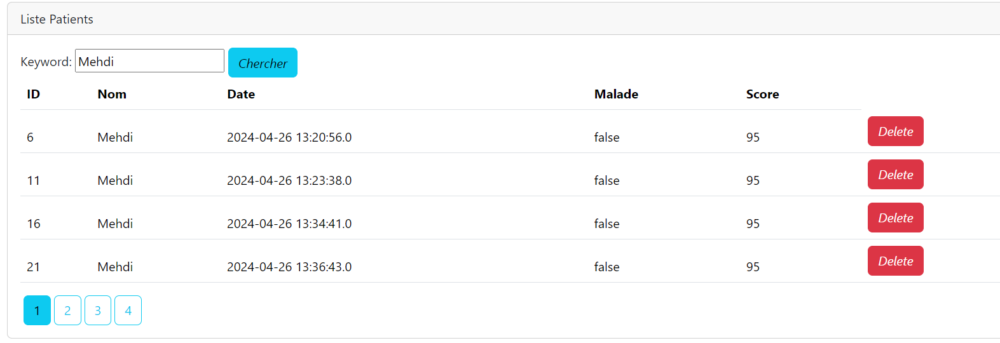
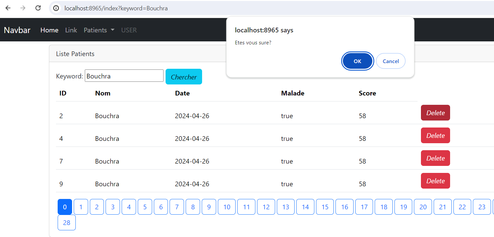
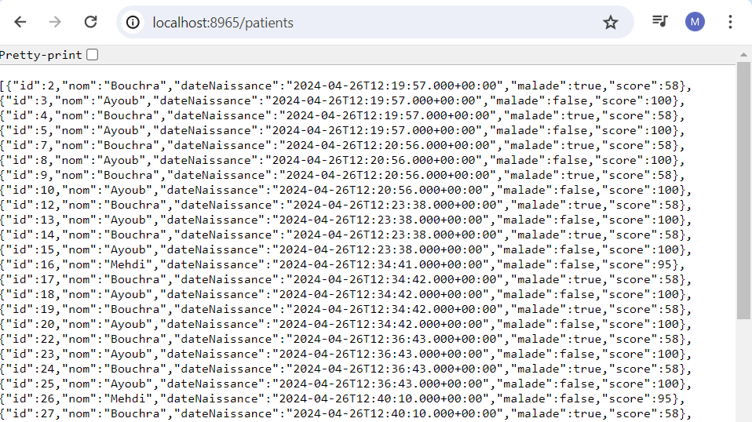
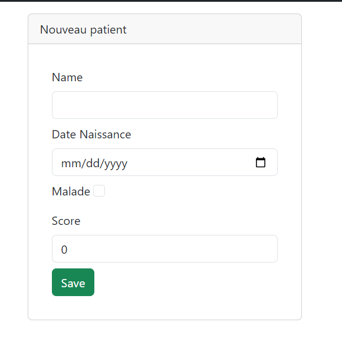
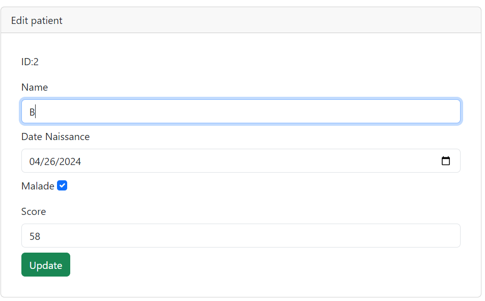

<h1> application Web JEE basée sur Spring MVC</h1>
<p1>-Afficher les patients,la pagination,Chercher un patient </p1>

<P1>-Supprimer un patient</P1>

<P1>-afficher tous les patients json</P1>

<P1>Nouveau patient</P1>

<P1>Edit un patient</P1>

